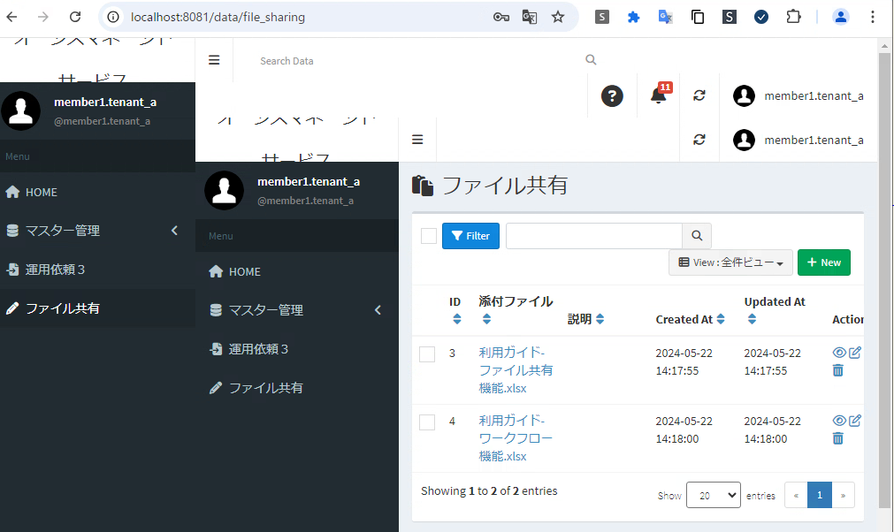

- [1. 環境整備](#1-環境整備)
- [2. jQueryアップデート](#2-jqueryアップデート)
- [3. 問題事象の再現手順](#3-問題事象の再現手順)


## 1. 環境整備

- 以下のドキュメントに沿って環境整備する
  - exment/document/ja/Develop.md at master · exceedone/exment
  - https://github.com/exceedone/exment/blob/master/document/ja/Develop.md


## 2. jQueryアップデート

```
BASEDIR=/var/www/exment_dev
cd ${BASEDIR}/vendor/exceedone/laravel-admin/resources/assets/AdminLTE/plugins/jQuery

## Backup old version jQuery 2.1.4 (2015/04)
mv jQuery-2.1.4.min.js jQuery-2.1.4.min.js.orig

## Put new version jQuery 3.7.1 (2023/08) with jquery-migrate
curl -L https://code.jquery.com/jquery-3.7.1.js          -o jquery-3.7.1.js
curl -L https://code.jquery.com/jquery-migrate-3.5.2.js  -o jquery-migrate-3.5.2.js
cat jquery-3.7.1.js jquery-migrate-3.5.2.js              >  jQuery-2.1.4.min.js

## Publish changes
cd ${BASEDIR} && php artisan exment:publish
```


## 3. 問題事象の再現手順

- 上記の操作のあと、WEBブラウザでExmentへログインする
- 左サイドメニューのうち、コンテンツエリアを更新するものをクリックする
- コンテンツエリア内にも、左サイドメニュー・ヘッダー・フッター が表示される
  - 
