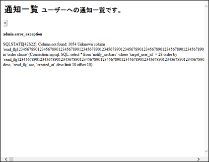

# 脆弱性診断結果の是正状況

- [1. Vex](#1-vex)
    - [1.1. オープンリダイレクト（危険度 中）](#11-オープンリダイレクト危険度-中)
    - [1.2. クロスサイトスクリプティング（危険度 低）](#12-クロスサイトスクリプティング危険度-低)
    - [1.3. セッション管理不備（危険度 中）](#13-セッション管理不備危険度-中)
    - [1.4. 過度な情報漏えい（危険度 低）](#14-過度な情報漏えい危険度-低)
    - [1.5. 不適切なエラー処理（危険度 低）](#15-不適切なエラー処理危険度-低)
    - [1.6. 不適切なエラー処理（危険度 低）](#16-不適切なエラー処理危険度-低)
    - [1.7. セキュリティ設定の不備（危険度 中）](#17-セキュリティ設定の不備危険度-中)
    - [1.8. セキュリティ設定の不備（危険度 低）](#18-セキュリティ設定の不備危険度-低)
    - [1.9. セキュリティ設定の不備（危険度 低）](#19-セキュリティ設定の不備危険度-低)


## 1. Vex

### 1.1. オープンリダイレクト（危険度 中）
- p.97 ID : 022987_URLInjectionAtHost-url_injection_parameter_manipulation
    - リクエストのHostヘッダに対してs.vulnexample.comを挿入したところ、HTMLから参照するリソースやリンク先のURLにhttp://s.vulnexample.com/または、https://s.vulnexample.com/が指定されました。この挙動から、意図しないURLへと誘導されてしまう可能性があります。
    - ユーザの入力値をリンク先として指定しないでください。

- 対策済み
    - httpd.conf で対策済み
        - `php/volumes/httpd.conf`

        ```apache
        <VirtualHost *:80>
            (中略)

            RewriteEngine On

            # Exit if FQDN and environment variable APP_FQDN do not match
            PassEnv APP_FQDN
            RewriteCond %{HTTP_HOST} !^${APP_FQDN}(:80)?$ [NC]
            RewriteRule ^ - [F]
        </VirtualHost>
        ```


### 1.2. クロスサイトスクリプティング（危険度 低）
- p.106 ID : 015481_NoCharsetOptionInTheContentTypeHeaderField-header_check
    - Content-Typeヘッダにcharsetパラメータが指定されていません。そのため、ブラウザは文字コードを推測します。この挙動から、ブラウザが文字コードを誤認識し、不正なJavaScriptが動作した場合、Cookieの漏えいや画面の改ざんが発生する可能性があります。
    - Webアプリケーションが想定している文字コードをContent-typeヘッダのcharsetパラメータに指定してください。

- 対策済み
    - httpd.conf で対策済み
        - `php/volumes/httpd.conf`

            ```apache
            AddDefaultCharset UTF-8
            ```


### 1.3. セッション管理不備（危険度 中）
- p.68 ID : 205935_InsecureCookies-checker
    - HTTPS上で利用されているCookieにsecure属性が指定されていません。そのため、HTTPでアクセスした際に、Cookieが平文で送信されてしまいます。
    - HTTPSで使用するCookieには、secure属性を付与してください。

- 対策済み
    - `laravel_session`
        - Laravel の .env で対策済み
        - `php/volumes/.env.template`

            ```ini
            SESSION_SECURE_COOKIE=true
            ```

- 対策しない
    - `AWSALB`
        - 対策しない理由 : セキュリティ的な問題は生じない。AWSの固定仕様であり対策できない


### 1.4. 過度な情報漏えい（危険度 低）
- p.165 ID : 205678_UnnecessaryInformationInHTMLComment-checker
    - HTMLコメント内に不必要なリソース情報が記載されています。この挙動から、システム情報などが漏えいする可能性があります。さらに、想定していない機能を利用される可能性があります。
    - レスポンス内のコメントは必要最低限での利用に制限し、重要な情報は含めないでください。

        ```html
                <!-- search form (Optional) -->
                <!--<form action="#" method="get" class="sidebar-form">
                    <div class="input-group">
                        <input type="text" name="q" class="form-control" placeholder="Search...">
                    <span class="input-group-btn">
                        <button type="submit" name="search" id="search-btn" class="btn btn-flat"><i class="fa fa-search"></i>
                        </button>
                    </span>
                    </div>
                </form>-->
                <!-- /.search form -->
        ```

- 対策しない
    - Exmentの仕様のため、受容する
    - 開発コミュニティへ情報をお伝えする
    - セキュリティ的な問題は生じない


### 1.5. 不適切なエラー処理（危険度 低）
- p.108 ID : 205690_MetaCharacterInjectionAllParams-checker
    - 全てのパラメータをNull文字や改行記号などに置換したところ、レスポンスにデフォルトのエラーが表示されました。この挙動から、サーバの内部情報が漏えいする可能性があります。
    - デフォルトのエラー画面は使用せず、カスタマイズされたエラーを表示してください。
        - p.108 : ワークフロー　全件ビュー　一覧表示　サーチ
            - `https://support-dev-alb-568849026.ap-northeast-1.elb.amazonaws.com:443/data/ops_applications3?&id=9069&created_at%5Bstart%5D=2024-08-19&created_at%5Bend%5D=2024-08-23&updated_at%5Bstart%5D=2024-08-19&updated_at%5Bend%5D=2024-08-23&workflow_...(中略)...%E5%BC%B1%E6%80%A7%E8%A8%BA%E6%96%AD%E7%94%A8&column_7abdbe9c4f15c30a0540%5Bstart%5D=2024-08-26&column_7abdbe9c4f15c30a0540%5Bend%5D=2024-08-30&column_83eba415a72309eee5c6=&isnull-column_83eba415a72309eee5c6=1&execute_filter=1&_pjax=%23pjax-container`
            - 
        - p.128 : ワークフロー　全件ビュー　ソート＋表示件数切替＋ページ切替
            - `https://support-dev-alb-568849026.ap-northeast-1.elb.amazonaws.com:443/data/ops_applications3?_pjax=%23pjax-container&_sort%5Bcolumn%5D=exm__85208978f463271a94b0.id&_sort%5Btype%5D=-1&_sort%5Bdirect%5D=1&per_page=10&page=2&_pjax=%23pjax-container`
            - 

- 再現させようと取り組み途中
    - 開発コミュニティへ情報をお伝えする
    - 環境依存ではなく、プログラム側に潜在的な問題がありそう
    - プログラム側のパラメータチェックか例外処理の改善が必要そう
    - セキュリティ的な問題は生じない


### 1.6. 不適切なエラー処理（危険度 低）
- p.154 ID : 205562_5000byteInsertError-error
    - パラメータに対して大量データを挿入したところ、レスポンスにデフォルトのエラーが表示されました。この挙動から、サーバの内部情報が漏えいする可能性があります。
    - デフォルトのエラー画面は使用せず、カスタマイズされたエラーを表示してください。
        - 通知　一覧表示　ソート＋表示件数切替＋ページ切替
            - `https://support-dev-alb-568849026.ap-northeast-1.elb.amazonaws.com:443/notify_navbar?_pjax=%23pjax-container&_sort%5Bcolumn%5D=read_flg&_sort%5Btype%5D=-1&per_page=10&page=2&_pjax=%23pjax-container`
            - 

- 再現させようと取り組み途中
    - 開発コミュニティへ情報をお伝えする
    - 環境依存ではなく、プログラム側に潜在的な問題がありそう
    - プログラム側のパラメータチェックか例外処理の改善が必要そう
    - セキュリティ的な問題は生じない


### 1.7. セキュリティ設定の不備（危険度 中） 
- p.82 ID : 205686_NoStrictTransportSecurity-checker
    - HTTPSでの通信時にStrict-Transport-Securityヘッダが出力されていない、またはmax-ageディレクティブの値が31536000(1年)以上に設定されていません。Strict-Transport-Securityヘッダが出力されていない場合、HTTPSの利用が強制されず、HTTPでの接続が可能です。
    - ドメイン上のすべてのWebページにHTTPSでアクセスできる場合、レスポンスにStrict-Transport-Securityヘッダを出力し、max-ageディレクティブの値を31536000(1年)以上に設定してください。

- 対策済み
    - httpd.conf で対策済み
        ```apache
            # Set Strict-Transport-Security
            Header always set Strict-Transport-Security "max-age=31536000; includeSubDomains"
        ```


### 1.8. セキュリティ設定の不備（危険度 低） 
- p.114 ID : 205603_CacheableSSLPage-checker
    - HTTPSページでキャッシュが抑制されていません。この挙動から、ブラウザにキャッシュされた機微情報が漏えいする可能性があります。
    - 個人情報などの重要な情報をやり取りする場合は、Cache-Controlヘッダにno-storeを指定し、キャッシュを抑制してください。

- 対策済み
    - httpd.conf で対策済み
        ```apache
            # Set Cache-Control
            <FilesMatch "\.(gif|jpe?g|png|svgz?|webp|css|js)$">
                Header set Cache-Control "public, max-age=604800"
            </FilesMatch>
            <FilesMatch "\.(html?)$">
                Header always set Cache-Control "no-store, no-cache, must-revalidate"
            </FilesMatch>
        ```


### 1.9. セキュリティ設定の不備（危険度 低） 
- p.139 ID : 205575_NoContentSecurityPolicy-checker_not_found
    - Content-Security-Policyヘッダが出力されていない、またはContent-Security-Policyヘッダのフェッチディレクティブにワイルドカード(*)が指定されています。そのため、ブラウザのCross-Site Scriptingを抑制する機能が有効化されない可能性があります。
    - Content-Security-Policyヘッダをレスポンスヘッダに出力し、Content Security Policyを宣言してください。

- 対策済み
    - httpd.conf で対策済み
        ```apache
            # Set Content-Security-Policy
            Header always set Content-Security-Policy "default-src 'self'; script-src 'self' 'unsafe-inline' 'unsafe-eval'; style-src 'self' 'unsafe-inline'; img-src 'self' data:; font-src 'self' data:;"
        ```
